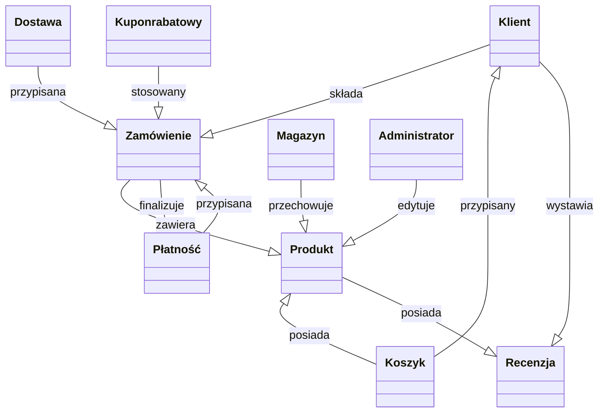

## Zad 1
https://bip.uni.wroc.pl/download/attachment/24057/zalacznik-nr-5-do-siwz-opis-przedmiotu-zamowienia.pdf

### F (funkcjonalność)
* instrukcja użytkownika systemu (opis funkcjonalność dla użytkowników, którzy nie są obeznani z pracą w systemie)  
_pytanie_: jaki jest poziom zaawansowania użytkownika, który ma korzystać z instrukcji?

* procedura zarządzania użytkownikami wewnętrznymi i zewnętrznymi  
_pytanie_: co to znaczy "zarządzanie użytkownikami" - chodzi o zarządzanie dostępem do systemu, czy o zarządzanie danymi użytkowników?

### U (użyteczność)
* instrukcja przywracania systemu po instalacji komponentu od Wykonawcy  
_pytanie_: w jaki sposób instrukcja ma być udokumentowana, jaką wiedzę posiada osoba, która ma ją wykonać?

### R (niezawodność)
* procedura przywracania środowiska systemu (w razie krytycznej awarii),  
_pytanie_: co znaczy "krytyczna awaria"? 

### P (wydajność)
* procedury zarządzania zasobami systemu  
_pytanie_: co to znaczy "zarządzanie zasobami systemu" - chodzi o zarządzanie zasobami sprzętowymi, czy o zarządzanie zasobami aplikacji?

### S (wsparcie)
* procedura przywracania konfiguracji środowiska systemu i/lub konfiguracji systemu  
_pytanie_: co to znaczy "konfiguracja systemu" - jaki zakres funkcjonalności systemu ona obejmuje?

* procedura wykonywania kopii systemu  
_pytanie_: co ta kopia powinna obejmować (cała baza danych, konfiguracja systemu), jak często powinna być wykonywana, gdzie powinna być przechowywana?

* procedura lub instrukcja wykonywania aktualizacji na serwerze  
_pytanie_: co to znaczy "aktualizacja" - czy chodzi o aktualizację systemu, czy o aktualizację danych?

## Zad 2
### Zakupy w sklepie internetowym (brief)
Nazwa: Zakupy w sklepie internetowym  
Aktorzy: Klient  
Krótki opis:  
Klient przegląda ofertę sklepu internetowego, dodaje wybrane produkty do koszyka, a następnie przechodzi do procesu zamówienia. Po podaniu danych dostawy i wyborze metody płatności finalizuje zakup. System przetwarza płatność, potwierdza zamówienie i wysyła klientowi stosowną informację.

### Zakupy w sklepie internetowym (fully dressed)
* Aktorzy:
	* Główny: Klient
	* Drugoplanowy: System płatności, System magazynowy

* Opis:
Klient wybiera produkty, dodaje je do koszyka, podaje dane dostawy, wybiera metodę płatności i finalizuje zamówienie. System przetwarza płatność i wysyła potwierdzenie.

* Warunki początkowe:
	* Klient ma dostęp do sklepu.
	* Produkty są dostępne.
	* System płatności działa.
	* Warunki zakończenia:

* Sukces: Zamówienie złożone, płatność zaakceptowana, klient otrzymuje potwierdzenie.
* Niepowodzenie: Błąd płatności lub brak dostępności produktu.
* Główny scenariusz sukcesu:
Klient przegląda ofertę i dodaje produkty do koszyka.  
Przechodzi do kasy, podaje dane dostawy i wybiera metodę płatności.  
System przetwarza płatność.  
System wysyła potwierdzenie i przekazuje zamówienie do realizacji.  

* Rozszerzenia:
	* Nieudana płatność → klient wybiera inną metodę.
	* Produkt niedostępny → system informuje klienta.

## Zad 3
**Zakupy w sklepie internetowym**

1. **Klient** – Osoba dokonująca zakupów w sklepie internetowym.
* Atrybuty: ID klienta, imię, nazwisko, e-mail, adres dostawy.
* Powiązania: może składać wiele zamówień.

2. **Zamówienie** – Proces zakupu produktów przez klienta w wyniku jedej platnosci.
* Atrybuty: ID zamówienia, data, status (np. „oczekujące”, „zrealizowane”).
* Powiązania: powiązane z jednym klientem i wieloma produktami.

3. **Produkt** – Przedmiot sprzedawany w sklepie internetowym.
* Atrybuty: ID produktu, nazwa, opis, cena, dostępna ilość.
* Powiązania: może być częścią wielu zamówień.

4. **Koszyk** – Tymczasowy zbiór produktów, które klient chce kupić.
* Atrybuty: ID koszyka, ID klienta, data utworzenia.
* Powiązania: zawiera wiele produktów, związany z jednym klientem.

5. **Płatność** – Proces finalizacji transakcji.
* Atrybuty: ID płatności, metoda (np. karta, przelew, PayPal), status (np. „zaakceptowana”, „odrzucona”).
* Powiązania: powiązana z jednym zamówieniem.
  
6. **Dostawa** – Proces wysyłki zamówionych produktów do klienta.
* Atrybuty: ID dostawy, przewoźnik, numer śledzenia, status (np. „w drodze”, „doręczona”).
* Powiązania: związana z jednym zamówieniem.

7. **Magazyn** – Miejsce przechowywania produktów.
* Atrybuty: ID magazynu, lokalizacja, dostępna przestrzeń.
* Powiązania: zawiera wiele produktów.

8. **Administrator** – Osoba zarządzająca sklepem.
* Atrybuty: ID administratora, imię, nazwisko, e-mail.
* Powiązania: może edytować informacje o produktach i zamówieniach.

9. **Recenzja** – Opinie klientów na temat produktów.
* Atrybuty: ID recenzji, ocena, komentarz, data.
* Powiązania: powiązana z jednym klientem i jednym produktem.

10. **Kupon rabatowy** – Zniżka stosowana do zamówienia.
* Atrybuty: ID kuponu, kod rabatowy, procent zniżki, data ważności.
* Powiązania: może być użyty w jednym zamówieniu.

## Zad 4
