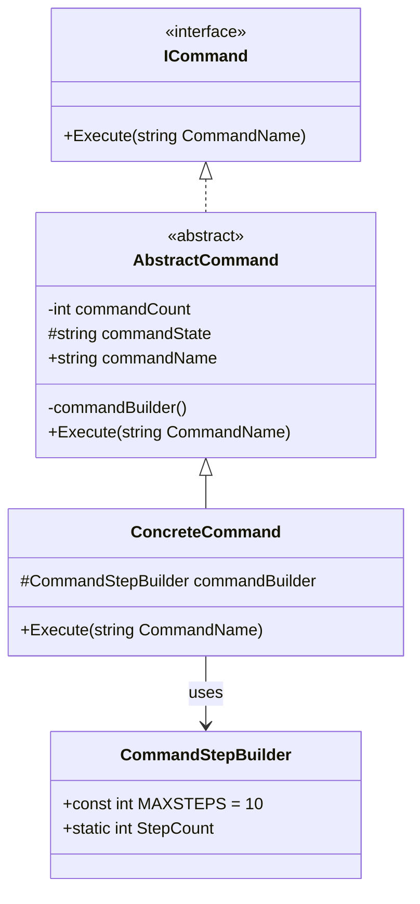
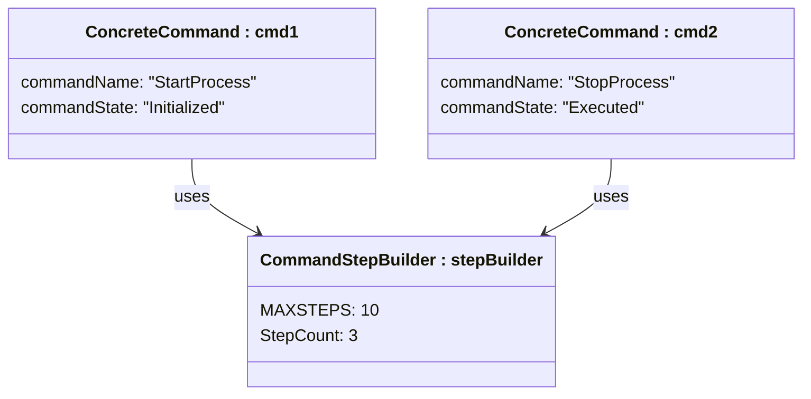
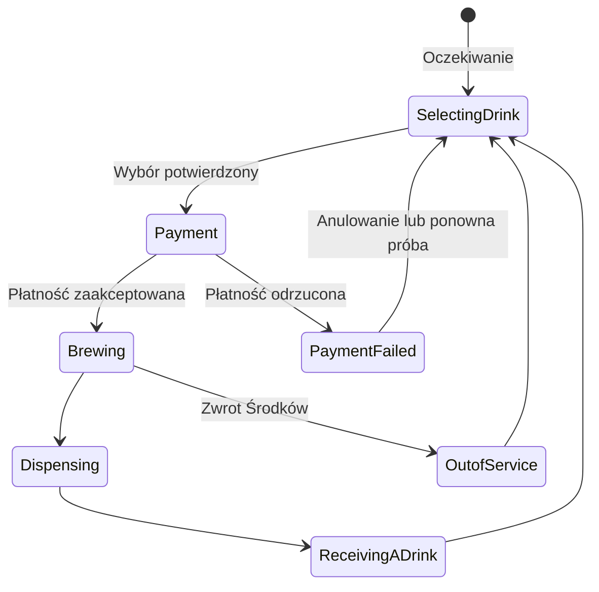
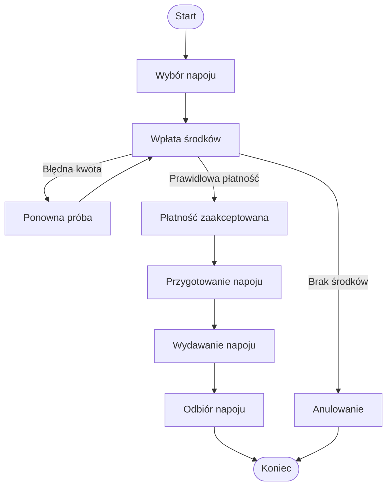
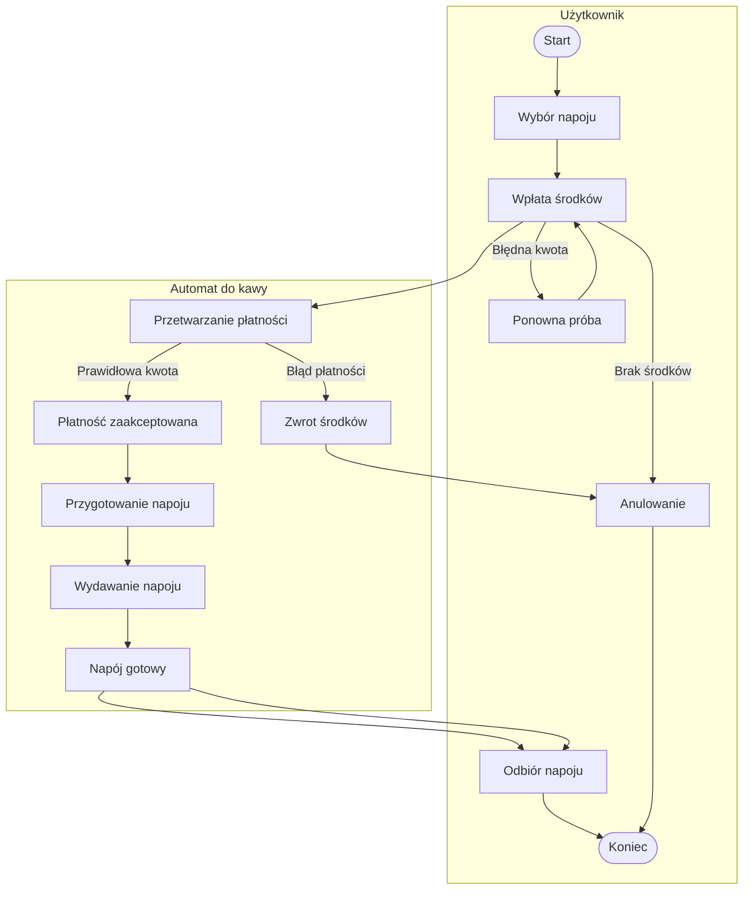
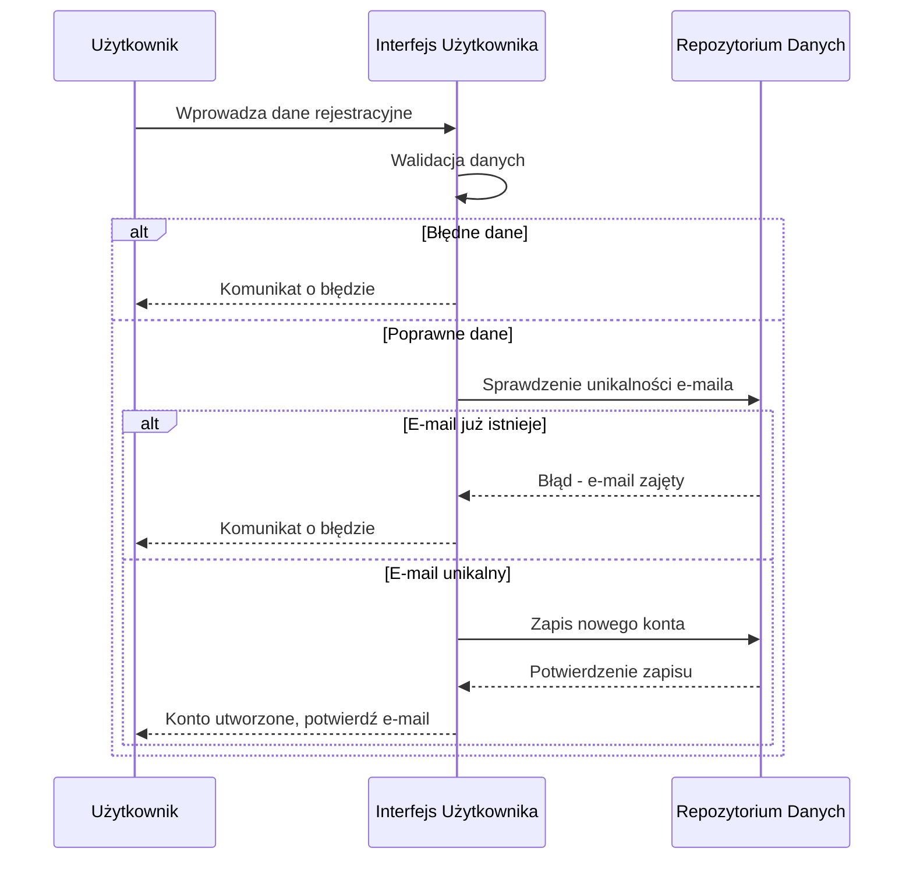
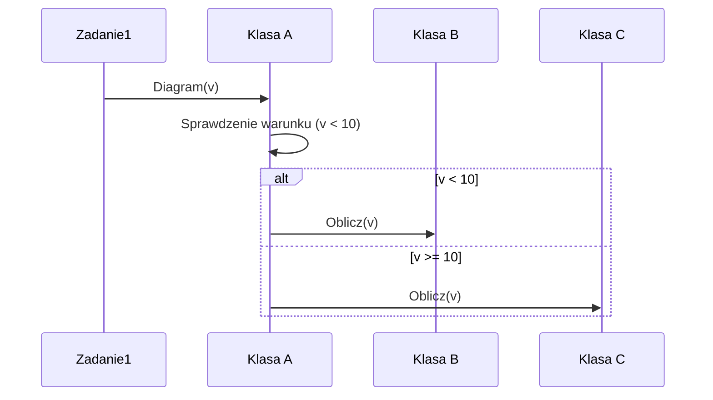
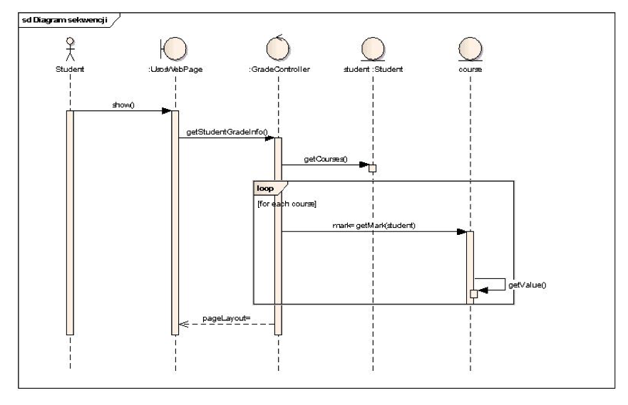

## Zad 1
Diagram klas na podstawie kodu
```csharp
public interface ICommand
{
    void Execute( string CommandName );
}
public abstract class AbstractCommand : ICommand
{
    private int commandCount;
    protected string commandState;
    public string commandName;
    private void commandBuilder() { }
    public abstract void Execute( string CommandName );
}
public class ConcreteCommand : AbstractCommand
{
    protected CommandStepBuilder commandBuilder;
    public override void Execute( string CommandName ) { }
}
public class CommandStepBuilder
{
    public const int MAXSTEPS = 10;
    public static int StepCount;
}
```



## Zad 2
Diagram obiektów

## Zad3
Diagram stanów


## Zad4
Diagram czynności (wersja bez partycji)


Diagram czynności (wersja z partycjami)


## Zad5
Diagram sekwencji


## Zad6
Diagram sekwencji na podstawie kodu
```csharp
public class Zadanie1 {
    A a;
    public void Diagram( int v ) {
        a.Wykonaj( v );
    } 
}
public class A {
    B b; C c;
    public void Wykonaj( int x ) {
        if ( x < 10 ) {
            b.Oblicz( x );
        else
            c.Oblicz( x );
        }
    } 
}
public class B {
    public void Oblicz( int n ) { }
}
public class C {
    public void Oblicz( int m ) { }
}
```


Na podstawie kodu, mozna narysowac precyzyjny diagram. Wynika to z tego, ze mamy os czasu i kazda klase. Rysujemy taka sciezke, ktora wedruje w zaleznosci od czasu i parametrow.

## Zad7

Kod na podstawie diagramu sekwencji

